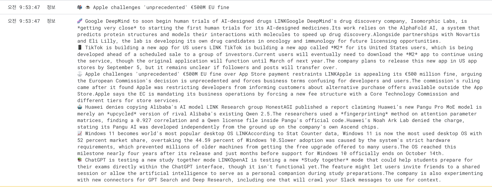

# techpresso-video-generator

1. 뉴스레터 메일 수집 및 파싱 자동화 - GAS (Google Apps Script) 활용

“외부 뉴스 콘텐츠를 자동으로 가져와서 필요 없는 것 쳐내고, 딱 쓰기 좋은 JSON으로 만들어 자동화 파이프라인에 연결해주는 역할”

- 메일을 직접 열지 않고 'techpresso' 발신자 키워드로 메일 찾음. 스케줄러 기능을 통해 하루 단위로 자동 실행.
- 메일 본문(HTML)에서 핵심 내용만 파싱 (제목, 상세 내용, 관련 이모지)
- 파싱된 기사 내용을 '제목', '본문', '원문링크' 형태의 JSON 배열로 정리
- UrlFetchApp.fetch() 사용하여 Make에서 생성한 Webhook URL로 POST 요청 (Make 시나리오 시작을 위함)

