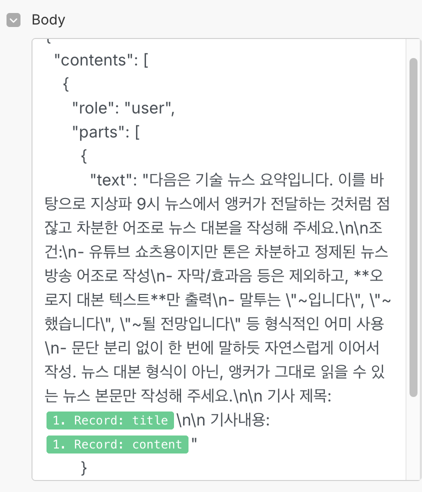

**[시나리오 1]**<br>
실행 순서: Webhook으로 뉴스 수신 → Supabase로 중복 여부 조회 → 새 기사면 Gemini로 번역 및 정제 → JSON 파싱 후 배열로 묶어 순차 저장 → Supabase에 Insert

1. 뉴스레터 메일 수집 및 파싱 자동화 - GAS (Google Apps Script) 활용

- 메일을 직접 열지 않고 'techpresso' 발신자 키워드로 메일 찾음. 스케줄러 기능을 통해 하루 단위로 자동 실행.
- 메일 본문(HTML)에서 핵심 내용만 파싱 (제목, 상세 내용, 관련 이모지)
- 파싱된 기사 내용을 '제목', '본문', '원문링크' 형태의 JSON 배열로 정리
- UrlFetchApp.fetch() 사용하여 Make에서 생성한 Webhook URL로 POST 요청 (Make 시나리오 시작을 위함)
    
    <details>
        <summary>스크립트 실행 예시</summary>
        
    </details>
    
2. Make 시나리오 시작 및 중복 체크

- Custom Webhook 모듈이 JSON 수신
- 이미 저장한 기사인지 체크 (Supabase REST API - GET 요청)
- Query string은 bundle 데이터 중 subject 항목을 이용 

    <details>
        <summary>기사 중복 체크</summary>
        
    </details>

- true이면 기존에 저장된 row 반환 (중복이므로 시나리오 종료)
- false이면 빈 배열 [] 반환 (다음 모듈 실행)
- Router 모듈 사용하여 true, false 분기

    <details>
        <summary>시나리오 분기</summary>
        
    </details>
    
3. 기사 번역 및 내용 가공 - Gemini API 활용

- 영어에서 한국어로 기사 내용 번역
- 각 기사마다 키워드 추출 

    <details>
        <summary>번역 프롬프트 내용</summary>
        
    </details>
   
- Gemini 응답값 정제
    - 불필요한 따옴표, 이스케이프 문자 제거 (Text Parser 모듈 사용)
    - 문자열 JSON 으로 변환 (JSON 모듈 사용)
    - 전 단계에서 출력된 다수의 레코드들을 하나의 배열로 합침(Array Aggregator 모듈 사용)

    ex. 번역 결과가 3개인 경우
    ```
    {title: "...", news_style_content: "..."}
    {title: "...", news_style_content: "..."}
    {title: "...", news_style_content: "..."}
    ```
    위 형식을 아래 배열로 변환
    ```
    [
        { "title": "...", "news_style_content": "..." },
        { "title": "...", "news_style_content": "..." },
        { "title": "...", "news_style_content": "..." }
    ]
    ```
    - 배열에 저장된 원소를 하나씩 꺼내서 반복 실행 (Iterator 모듈 사용)
    - DB에 기사 제목, 내용, 키워드를 저장 (HTTP 모듈 사용, Supabase REST API - PATCH 요청)

    <details>
        <summary>기사 DB 저장 예시</summary>
        
        
    </details>

---

**[시나리오 2]**<br>
실행 순서: 새로운 기사 감지 → Gemini로 뉴스 대본 변환 → 변환된 대본 Supabase 업데이트 → Google TTS로 음성 생성 → Supabase Edge Function으로 TTS 업로드 → 이미지 생성 요청

1. 새로운 뉴스레터 감지 - supabase.realtime 기능 활용
    - newsletter 테이블의 INSERT 트리거 사용 (row 추가 시 자동으로 실행)
    - DB 변경 이벤트 감지 (Make와 Supabase의 Watch Events 모듈 사용)
    - output은 감지된 레코드 (id, title, content, created_at 등)

2. 뉴스 대본 변환 - Gemini API 활용
    - 기사 번역본을 뉴스 방송용 대본으로 변환
    - news_style_content 칼럼 업데이트 (HTTP 모듈 사용, Supabase REST API - PATCH 요청)<br>
    <details>
        <summary>뉴스 대본 생성</summary>
        
    </details>

3. 음성 파일 생성 - Google Cloud TTS API 활용
    - 앞서 저장한 news_style_content 텍스트를 그대로 음성으로 변환
    - 요청 파라미터: ko-KR, Wavenet, mp3
    - output은 base64 인코딩된 음성 데이터<br>

    <details>
        <summary>뉴스 음성 파일 생성</summary>
        
    </details>

4. TTS 음성 일 업로드 - Supabase Edge Function 활용  
   - Google TTS에서 받은 base64 인코딩된 음성 데이터를 Supabase Storage에 mp3로 저장
    <details>
        <summary>Base64</summary>
    </details>

   - 저장 후 해당 audio_url을 newsletter 테이블에 업데이트  
   - Deno 기반 Edge Function으로 구현됨

    <details>
        <summary>convertAndUploadTTS 함수</summary>
        const audioBuffer = Uint8Array.from(atob(audioContent), (c)=>c.charCodeAt(0));

        // storage에 업로드 시 변환된 데이터 확장자 및 contentType을 지정하여 업로드
        const { error: uploadError } = await supabase
            .storage
            .from("newsletter-audio")
            .upload(`${newsletterId}.mp3`, audioBuffer, {
            contentType: "audio/mpeg",
            upsert: true
            });
        ```
    </details>

5. AI 이미지 생성 및 업로드 
    - Cloudflare API를 활용하여 Stable Diffusion 모델 기반 이미지 생성
    - 앞서 저장한 keyword를 바탕으로 생성 

    <details>
        <summary>이미지 생성 프롬프트</summary>
        
    </details>

    <details>
        <summary>convertAndUploadTTS 함수</summary>
        const cfApiUrl = "https://api.cloudflare.com/client/v4/accounts/63664cadd55e384ef4bb81a0cff74a32/ai/run/@cf/stabilityai/stable-diffusion-xl-base-1.0";
        const cfRes = await fetch(cfApiUrl, {
            method: "POST",
            headers: {
                Authorization: `Bearer 토큰`,
                "Content-Type": "application/json"
            },
            body: JSON.stringify({
                prompt,
                num_steps
            })
        });
        ```
    </details>


---

**[에러]**<br>

1. Google Cloud TTS 400 인증 오류 

    - 위치: Content Converter 시나리오 내 TTS 모듈 
        <details>
            <summary>Make 내 TTS 모듈</summary>
            
        </details>

    - 에러 문구<br>
        <details>
            <summary>400 에러</summary>
            
        </details>
   

    - 해결 방법<br>
        1. Google Cloud Console 접속
        2. `API 및 서비스` → `사용자 인증 정보`
        3. `사용자 인증 정보 만들기` 선택
        4. `OAuth 클라이언트 ID` 선택
        5. **플랫폼**: `웹 어플리케이션` 선택  
        - 리디렉션 URI: [`https://www.integromat.com/oauth/cb/google-custom`](https://www.integromat.com/oauth/cb/google-custom)
        6. 클라이언트 ID 및 Secret 생성
        7. Make 모듈 설정에서 `client ID` 및 `secret` 값 재입력
        
        <details>
            <summary>OAuth 재인증</summary>
            
        </details>
    